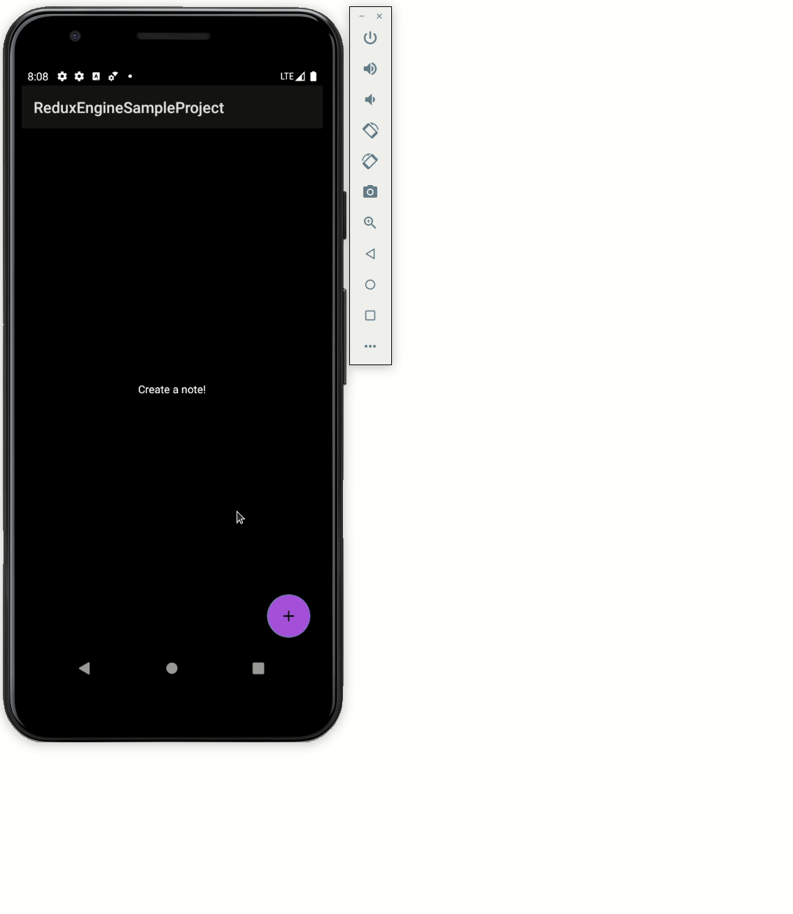

# ReduxEngineSampleProject

Showcases usage of [ReduxEngine](https://github.com/grant-park/ReduxEngine). 

* Minimal view layer with minimal business logic via single activity + views + model. No fragments :) 
* Effects of orientation changes are handled via ConflatedBroadcastReceiver. 
* App state is persisted beyond process death via SharedPreferences. Although it could just as easily be handled by an ORM and an epic. 

